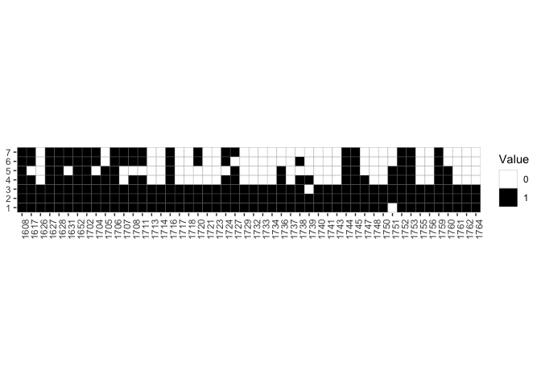
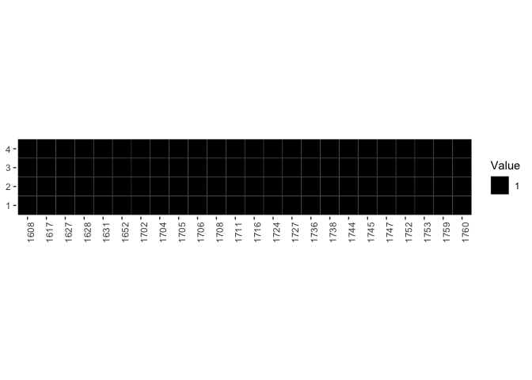

Longitudinal\_data
================

## Liège Corpus Sampling

### Option 1: More time points, missing data points

There is a grouping of 7 data collection points that span three academic
years: 2017/2018 (3 collection points), 2018/2019 (2 collection points),
& 2019/2020 (2 collection points), rougly corresponding to the first
cohort of students in the corpus

  - 50 students have contributed at least 3 texts across these 7 time
    points (only 12 contributed texts at all 7 time points)

  - We have numeric scores out of 20 for 5/7 of the data points

  - We have submission dates for 2/7 of the data points

  - The topics of the texts vary (there are no recurring topics):
    
    topic 1: jouw ervaring met taalkennis
    
    topic 2: het milieu
    
    topic 3: geloof jij nog in het Europese project?
    
    topic 4: verhoging van inschrijvingsgeld
    
    topic 5: verengelsing van de maatschappij
    
    topic 6: een multiculturele samenleving
    
    topic 7: beschrijf een grafiek (sociale media)

<!-- -->

**Statistical analysis**

Outcome variable:

  - complexity measures (= one model per complexity measure)

  - we are interested in modeling the trajectory of the complexity
    measures over time

Proficiency:

  - the only indicator of proficiency/performance in this data set is
    the score out of 20 assigned to the texts

  - issues with our measure of performance: expectations increase across
    year levels; inconsistent scores for the same students; many scores
    of 0

  - measure of initial/average proficiency/performance: averaging scores
    over all texts; overall grade for course

  - metadata survey proficiency information not very useful:
    self-reported proficiency or results of various proficiency exams
    (and not for many of these students)

Descriptive:

  - Plot individual trajectories for development of complexity measures

  - Is it worth modeling exact (non-linear) trajectories for this data
    set when we can analyze the observed data (if we do want to model
    non-linear trends, what kind of non-linear trends do we allow for?)

Linear (mixed-effects) modeling:

  - See how well a linear model can be fitted to the data; is there an
    overal linear trend of complexity development over time?

  - simple models (one table to present output of all statistical
    modeling)

### Option 2: Smaller overall timeframe, no missing data points

A subset of 4 of the above set of 7 texts has been collected from 24
students. This set of texts was collected from the first year of the
bachelor in the 2017/2018 academic year and at the beginning of the
bachelor 2 level in the 2018/2019 academic year (so a span of about 1
full calendar year)

The data set includes about half the amount of students as option 1, but
with the simple models proposed for this study, it shouldn’t be an
issue. Additionally, we wouldn’t have to deal with missing data points.

<!-- -->

### Dealing with topic variation in the corpus

The topics in the two samples proposed above all differ at each
collection point for the analysis

  - On the one hand, this is less problematic because the topics are new
    for all students

Analyzing different topics at one time point (or similar time points)

  - Do topics differ in complexity?

Analyzing the same topic across several cohorts

  - Does complexity of one topic differ across cohorts of students?

Analyzing the same topic by the same students at different time points

  - 11 students submitted a text written in respose to the same topic in
    bachelor 1 2017/2018 and bachelor 1 2018/2019

  - Does complexity develop over time when controlling for topic?
