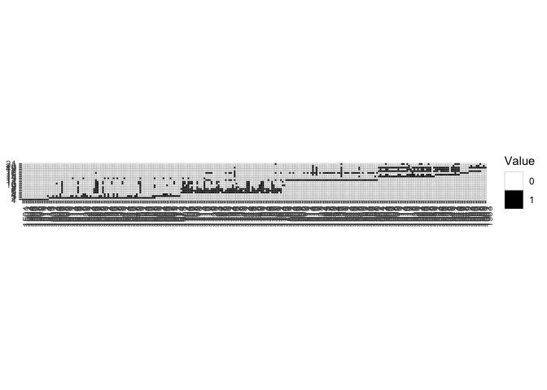

Liege\_corpus
================

The students\_liege dataset contains metadata collected for the Liège
corpus, including the number of texts collected from each student, the
collection year of the texts, the score (/20) for each text, and learner
metadata for the students who responded to the metadata survey.

The corpus contains texts from 261 students, with an average of 2.9
texts per student (see below for specifics on number of texts collected
per student). The majority of students contributed one or two texts,
while at least 20 students contributed at least 5 texts.

    ## 
    ##  1  2  3  4  5  6  7  8  9 10 
    ## 80 59 43 24 25 13  8  6  2  1

Visual overview of density/sparsity of texts in Liege corpus below
(easier to view this plot separately as PNG so you can zoom in):

<!-- -->

The plot indicates two separate cohorts, one that spans the texts from
2016/2017 - 2018/2019 and another from 2018/2019 - 2020/2021

Determining the texts with the most overlap across learners in the first
cohort:

``` r
nrow(students_texts[students_texts$BAC1_17_18_opstel_1==1 & students_texts$BAC1_17_18_opstel_2==1 & students_texts$BAC1_17_18_opstel_4==1 & students_texts$BAC2_18_19_opstel_1==1 & students_texts$BAC2_18_19_opstel_2==1 & students_texts$BAC3_19_20_opstel_1==1 & students_texts$BAC3_19_20_opstel_2==1,])
```

    ## [1] 12

``` r
nrow(students_texts[students_texts$BAC1_17_18_opstel_1==1 & students_texts$BAC1_17_18_opstel_2==1 & students_texts$BAC1_17_18_opstel_4==1 & students_texts$BAC2_18_19_opstel_1==1 & students_texts$BAC3_19_20_opstel_1==1 & students_texts$BAC3_19_20_opstel_2==1,])
```

    ## [1] 18

``` r
nrow(students_texts[students_texts$BAC1_17_18_opstel_1==1 & students_texts$BAC1_17_18_opstel_2==1 & students_texts$BAC1_17_18_opstel_4==1 & students_texts$BAC2_18_19_opstel_1==1 & students_texts$BAC3_19_20_opstel_1==1,])
```

    ## [1] 19

``` r
nrow(students_texts[students_texts$BAC1_17_18_opstel_1==1 & students_texts$BAC1_17_18_opstel_2==1 & students_texts$BAC1_17_18_opstel_4==1 & students_texts$BAC2_18_19_opstel_1==1,])
```

    ## [1] 24

``` r
nrow(students_texts[students_texts$BAC1_17_18_opstel_1==1 & students_texts$BAC1_17_18_opstel_2==1 & students_texts$BAC1_17_18_opstel_4==1,])
```

    ## [1] 48

We have collected BAC1\_17\_18\_opstel\_1, BAC1\_17\_18\_opstel\_2, &
BAC1\_17\_18\_opstel\_4 from 48 students. These texts are all from the
first year of the bachelor program in the 2017-2018 academic year. We
know the first of the three assignments was submitted on 20/10/2017, no
date provided for the second two. All three texts have scores out of 20.
Of the 48 students, 36 have provided metadata.

Determining the texts with the most overlap across learners in the
second
cohort:

``` r
nrow(students_texts[students_texts$BAC1_19_20_opstel_1==1 & students_texts$BAC1_19_20_opstel_2==1 & students_texts$BAC1_19_20_opstel_3==1 & students_texts$BAC1_19_20_opstel_4==1 & students_texts$BAC1_19_20_opstel_5==1 & students_texts$BAC1_19_20_opstel_6==1,])
```

    ## [1] 1

``` r
nrow(students_texts[students_texts$BAC1_19_20_opstel_1==1 & students_texts$BAC1_19_20_opstel_2==1 & students_texts$BAC1_19_20_opstel_3==1 & students_texts$BAC1_19_20_opstel_4==1 & students_texts$BAC1_19_20_opstel_6==1,])
```

    ## [1] 3

``` r
nrow(students_texts[students_texts$BAC1_19_20_opstel_1==1 & students_texts$BAC1_19_20_opstel_2==1 & students_texts$BAC1_19_20_opstel_4==1 & students_texts$BAC1_19_20_opstel_6==1,])
```

    ## [1] 16

``` r
nrow(students_texts[students_texts$BAC1_19_20_opstel_2==1 & students_texts$BAC1_19_20_opstel_4==1 & students_texts$BAC1_19_20_opstel_6==1,])
```

    ## [1] 30

``` r
nrow(students_texts[students_texts$BAC1_19_20_opstel_1==1 & students_texts$BAC1_19_20_opstel_4==1 & students_texts$BAC1_19_20_opstel_6==1,])
```

    ## [1] 31

We have collected BAC1\_19\_20\_opstel\_1, BAC1\_19\_20\_opstel\_4, &
BAC1\_19\_20\_opstel\_6 from 31 students. These texts are all from the
first year of the bachelor program in the 2019-2020 academic year. We
know the first text was submitted on 4/10/2019 (no scores), the second
text on 10/04/2020 (scores out of 20), and the third text on 06/2020 (no
scores). Most of the second cohort of students have not provided
metadata as we collected these texts after the distribution of the
metadata survey in 2018/2019.

Collection dates and grades: (all grades/scores are out of 20)

MA1\_18\_19\_opstel\_1:  
    Date: no; Grades: yes  
BAC1\_16\_17\_opstel\_1:  
    Date: 30/09/2016 Grades: yes  
BAC3\_18\_19\_opstel\_1:  
    Date: no; Grades: yes  
BAC3\_18\_19\_opstel\_2:  
    Date: 05/2019; Grades: no  
BAC1\_17\_18\_opstel\_1:  
    Date: 20/10/2017; Grades: yes  
BAC1\_17\_18\_opstel\_2:  
    Date: no; Grades: yes  
BAC1\_17\_18\_opstel\_4:  
    Date: no; Grades: yes  
BAC2\_18\_19\_opstel\_1:  
    Date: 10/2018; Grades: no  
BAC2\_18\_19\_opstel\_2:  
    Date: no; Grades: no  
BAC3\_19\_20\_opstel\_1:  
    Date: no; Grades: yes  
BAC3\_19\_20\_opstel\_2:  
    Date: no; Grades: yes  
BAC1\_18\_19\_opstel\_1:  
    Date: 28/09/2018; Grades: yes  
BAC3\_20\_21\_opstel\_1:  
    Date: 12/2020; Grades: no  
BAC1\_19\_20\_opstel\_1:  
    Date: 4/10/2019; Grades: no  
BAC1\_19\_20\_opstel\_2:  
    Date: no; Grades: yes  
BAC1\_19\_20\_opstel\_3:  
    Date: no; Grades: yes  
BAC1\_19\_20\_opstel\_4:  
    Date: 10/04/2020; Grades: yes  
BAC1\_19\_20\_opstel\_5:  
    Date: no; Grades: yes  
BAC1\_19\_20\_opstel\_6:  
    Date: 06/2020; Grades: no  
BAC1\_19\_20\_opstel\_7:  
    Date: 08/2020; Grades: no  
BAC2\_20\_21\_opstel\_1:  
    Date: 27/10/2020; Grades: yes
