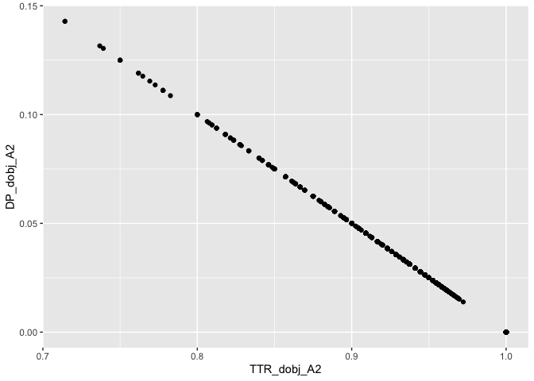

Study2\_measures
================

# CNaVT Data Overview

Measures in study 2 were computed for 3,103 learner texts produced by
1,785 learners. Exam results are available for 1,474 learners. The
distribution of learners for whom exam results have been collected is
presented below across CEFR exam level (B1/B2/C1) and L1 backgrounds.

|    | Duits | Frans | Nederlands | Other |
| -- | ----: | ----: | ---------: | ----: |
| B1 |    63 |   112 |          5 |    46 |
| B2 |   144 |   653 |        113 |   115 |
| C1 |    29 |    11 |          9 |   174 |

CNaVT learners by CEFR level & L1

And below is the distribution of learners who passed the exam.

|    | Duits | Frans | Nederlands | Other |
| -- | ----: | ----: | ---------: | ----: |
| B1 |    48 |    51 |          5 |    35 |
| B2 |    85 |   428 |        103 |    91 |
| C1 |    16 |     5 |          7 |    50 |

Passing CNaVT learners by CEFR level & L1

# Complexity measures

## Dependency-based measures

### Diversity

For dependency-based diversity measures (phraseological units = dobj,
amod, & advmod), we consider TTR (to not overcorrect for text length)
and DP (dispersion as a diversity measure)

The plot below shows TTR plotted against DP for all three dependencies

    ## Warning: Removed 14 rows containing missing values (geom_point).

<!-- -->
