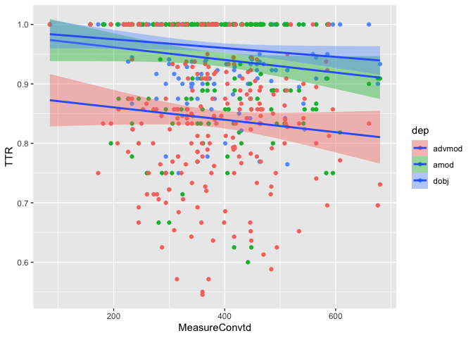
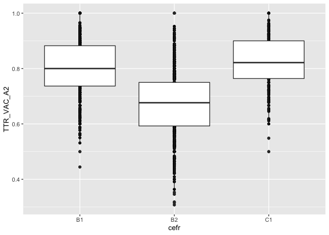

Study2\_measures
================

# CNaVT Data Overview

Measures in study 2 were computed for 3,103 learner texts produced by
1,785 learners. Exam results are available for 1,474 learners. The
distribution of learners for whom exam results have been collected is
presented below across CEFR exam level (B1/B2/C1) and L1 backgrounds.

|    | Duits | Frans | Nederlands | Other |
| -- | ----: | ----: | ---------: | ----: |
| B1 |    63 |   112 |          5 |    46 |
| B2 |   144 |   653 |        113 |   115 |
| C1 |    29 |    11 |          9 |   174 |

CNaVT learners by CEFR level & L1

And below is the distribution of learners who passed the exam.

|    | Duits | Frans | Nederlands | Other |
| -- | ----: | ----: | ---------: | ----: |
| B1 |    48 |    51 |          5 |    35 |
| B2 |    85 |   428 |        103 |    91 |
| C1 |    16 |     5 |          7 |    50 |

Passing CNaVT learners by CEFR level & L1

# Complexity measures

## Dependency-based measures

### Diversity

For dependency-based diversity measures (phraseological units = dobj,
amod, & advmod), we consider TTR (to not overcorrect for text length)
and DP (dispersion as a diversity measure)

The plot below shows TTR plotted against DP for dobj dependencies for
task 2. The measures are perfectly correlated so either can serve as a
diversity measure in the study. The correlation with text length is low
(.15) as text length does not vary greatly in the CNaVT dataset.

    ## Warning: Removed 14 rows containing missing values (geom_point).

<!-- -->

Below are figures plotting TTR of each dependency type against the CEFR
level of the learner

<!-- -->

And for only the passing exams:

<!-- -->

Below are figures plotting TTR of each dependency type against the
overall numeric score for each separate exam level

B1

    ## `geom_smooth()` using formula 'y ~ x'

<!-- -->

B2

    ## `geom_smooth()` using formula 'y ~ x'

<!-- -->

C1

    ## `geom_smooth()` using formula 'y ~ x'

<!-- -->

### Sophistication

For dependency-based sophistication measures, we look at PMI-based
measures (mean PMI per text, PMI IQR, and collocational-band based PMI
measures)

Below are figures plotting mean PMI against CEFR level for each
dependency type

<!-- -->

And for only the passing exams:

<!-- -->

Below are figures plotting mean PMI of each dependency type against the
overall numeric score for each separate exam level

B1

    ## `geom_smooth()` using formula 'y ~ x'

<!-- -->

B2

    ## `geom_smooth()` using formula 'y ~ x'

<!-- -->

C1

    ## `geom_smooth()` using formula 'y ~ x'

<!-- -->

Below are figures plotting PMI IQR against CEFR level for each
dependency type

<!-- -->

And for only passing exams:

<!-- -->

Below are figures plotting PMI IQR of each dependency type against the
overall numeric score for each separate exam level

B1

    ## `geom_smooth()` using formula 'y ~ x'

<!-- -->

B2

    ## `geom_smooth()` using formula 'y ~ x'

<!-- -->

C1

    ## `geom_smooth()` using formula 'y ~ x'

<!-- -->

## Verb-argument structure measures

### Diversity

For verb-argument structure diversity measures, we consider TTR (to not
overcorrect for text length)

Below are figures plotting TTR of verb-argument structures against the
CEFR level of the learner

<!-- -->

And for only passing exams:

<!-- -->

Below are figures plotting TTR of verb-argument structures against the
overall numeric score for each separate exam level

B1

    ## `geom_smooth()` using formula 'y ~ x'

<!-- -->

B2

    ## `geom_smooth()` using formula 'y ~ x'

<!-- -->

C1

    ## `geom_smooth()` using formula 'y ~ x'

<!-- -->

### Sophistication

For verb-argument structure sophistication measures, we consider PMI
mean per text and Entropy mean per text

Below are figures plotting PMI mean of verb-argument structures against
the CEFR level of the learner

<!-- -->

And for only passing exams:

<!-- -->

Below are figures plotting PMI mean of verb-argument structures against
the overall numeric score for each separate exam level

B1

    ## `geom_smooth()` using formula 'y ~ x'

<!-- -->

B2

    ## `geom_smooth()` using formula 'y ~ x'

<!-- -->

C1

    ## `geom_smooth()` using formula 'y ~ x'

<!-- -->

Below are figures plotting Entropy mean of verb-argument structures
against the CEFR level of the learner

<!-- -->

And for only passing exams:

<!-- -->

Below are figures plotting Entropy mean of verb-argument structures
against the overall numeric score for each separate exam level

B1

    ## `geom_smooth()` using formula 'y ~ x'

<!-- -->

B2

    ## `geom_smooth()` using formula 'y ~ x'

<!-- -->

C1

    ## `geom_smooth()` using formula 'y ~ x'

<!-- -->

# Overview trends

TTR as a diversity measure for dependency-based phraseological units
does not appear to exhibit consistent linear trends across CEFR levels
over all CNaVT exams or across increasing numerical exam scores for each
individual CEFR exam level.

TTR of verb-argument structures also generally demonstrates non-linear
trends across all levels of the CNaVT data.

While sophistication measures for dependency-based units (PMI mean &
IQR) do not exhibit linear development across CEFR levels in general,
there is some linear development across increasing numerical exam scores
at the individual CNaVT exam levels. Specifically, PMI mean of dobjs
increases linearly for the B1 exam, and PMI mean of dobjs & amods
increases linearly for the B2 & C1 exams. As for PMI IQR, there is
linear development across numerical exam scores for all three dependency
types at the B1 level, for amods at the B2 level, and for no dependency
types at C1.

While sophistication of verb-argument structures measured in PMI means
increases linearly (very slightly) across CEFR levels for all exams, in
addition to linearly across increasing numerical exam scores for all
three CNaVT exam levels, sophistication measured in Enntropy means
displays a non-linear trend across CEFR levels overall, a slightly
negative linear trend across numerical exam scores at B2 and a slightly
positive linear trend across numerical exam scores at C1.

Linear predictors across CEFR levels: TTR advmod (positive trend), PMI
mean advmod (negative trend), PMI mean verb-argument structure (positive
trend)

Linear predictors numerical exam score B1: TTR dobj, amod, & advmod (all
negative trend), PMI mean dobj (positive trend), PMI IQR dobj, amod, &
advmod (all positive trend), TTR verb-argument structures (negative
trend), PMI mean verb-argument structure (positive trend)

Linear predictors numerical exam score B2: TTR advmod (negative trend),
PMI mean dobj & amod (positive trend), PMI IQR amod (positive trend),
PMI mean verb-argument structure (positive trend), Entropy mean
verb-argument structure (negative trend)

Linear predictors numerical exam score C1: TTR advmod (positive trend),
PMI mean dobj & amod (positive trend), PMI mean verb-argument structure
(positive trend), Entropy mean verb-argument structure (positive trend)
