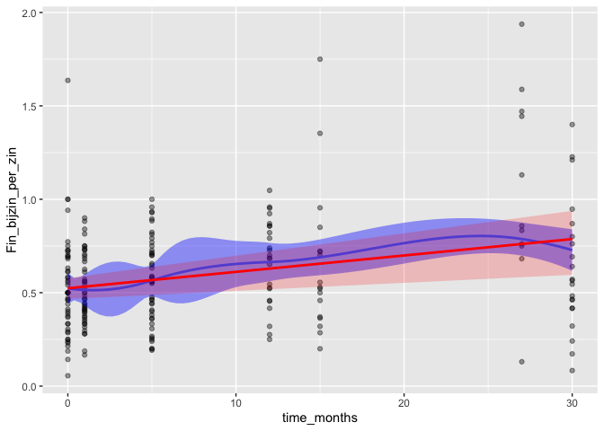
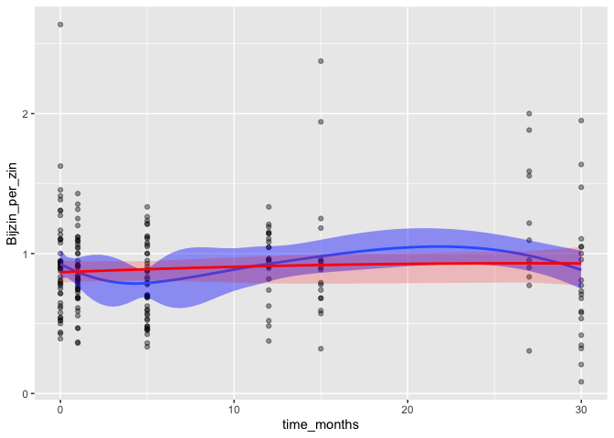

Longitudinal analysis
================

## Statistical analysis

### Modeling complexity measures as a function of time

For each measure, we report a linear mixed effects regression with time
(linear & quadratic) as the sole predictor and random intercepts for
learners. Each measure was first modeled with a linear term for time,
and this model is compared with the null model to determine if the model
significantly improves upon the null model. Afterwards, a quadratic term
for time is added to the model, which is then compared with the previous
model to determine whether the addition of a nonlinear term for time
improves upon the model.

The plot for each complexity measure compares the modeled effects with
the observed values. We also look at marginal and conditional R-squared
values for each measure to compare fixed vs. random effects.

#### Mean MI Dobj

``` r
anova(meanMIdobj_MM_null,meanMIdobj_MM,meanMIdobj_MM_poly) #time
```

    ## Data: liege_48
    ## Models:
    ## meanMIdobj_MM_null: meanMIdobj ~ (1 | studentid)
    ## meanMIdobj_MM: meanMIdobj ~ (1 | studentid) + time_months
    ## meanMIdobj_MM_poly: meanMIdobj ~ (1 | studentid) + poly(time_months, 2)
    ##                    Df    AIC    BIC  logLik deviance   Chisq Chi Df
    ## meanMIdobj_MM_null  3 636.37 646.50 -315.19   630.37               
    ## meanMIdobj_MM       4 633.77 647.27 -312.88   625.77  4.6052      1
    ## meanMIdobj_MM_poly  5 617.59 634.46 -303.79   607.59 18.1814      1
    ##                    Pr(>Chisq)    
    ## meanMIdobj_MM_null               
    ## meanMIdobj_MM         0.03188 *  
    ## meanMIdobj_MM_poly  2.008e-05 ***
    ## ---
    ## Signif. codes:  0 '***' 0.001 '**' 0.01 '*' 0.05 '.' 0.1 ' ' 1

``` r
R2
```

    ##             R2m        R2c
    ## [1,] 0.09928071 0.09928071

The model fit is singular (this is the only measure for which this is
the case).  
The output of the anova indicates that the linear term for time is a
significant improvement upon the null model, and the quadratic term is a
significant improvement on the linear term.  
R2 for the best-fitting model is .099 marginal & .099 conditional (the
fixed effects do not account for any variance beyond the random
effects)

<!-- -->
<!-- -->

The plots show the observed values for meanMIdobj (points) across the
time variable, a smooth line (lm) for the ovserved values (blue), and a
smooth line (lm) for the fitted regression (red)  
The top plot is for the regression line with a single linear term  
The lower plot is for the quadratic regression line

#### RTTR dobj

``` r
anova(RTTR_dobj_MM_null,RTTR_dobj_MM,RTTR_dobj_MM_poly) #time
```

    ## Data: liege_48
    ## Models:
    ## RTTR_dobj_MM_null: RTTR_dobj ~ (1 | studentid)
    ## RTTR_dobj_MM: RTTR_dobj ~ (1 | studentid) + time_months
    ## RTTR_dobj_MM_poly: RTTR_dobj ~ (1 | studentid) + poly(time_months, 2)
    ##                   Df    AIC    BIC  logLik deviance  Chisq Chi Df
    ## RTTR_dobj_MM_null  3 527.41 537.54 -260.71   521.41              
    ## RTTR_dobj_MM       4 524.75 538.25 -258.37   516.75 4.6686      1
    ## RTTR_dobj_MM_poly  5 520.55 537.42 -255.27   510.55 6.1992      1
    ##                   Pr(>Chisq)  
    ## RTTR_dobj_MM_null             
    ## RTTR_dobj_MM         0.03072 *
    ## RTTR_dobj_MM_poly    0.01278 *
    ## ---
    ## Signif. codes:  0 '***' 0.001 '**' 0.01 '*' 0.05 '.' 0.1 ' ' 1

``` r
R2
```

    ##             R2m       R2c
    ## [1,] 0.04566601 0.1655963

The output of the anova indicates that the linear term for time is a
significant improvement upon the null model, and the quadratic term is a
significant improvement on the linear term. R2 for the best-fitting
model is .046 marginal & .166 conditional (the random effects account
for more variance than the fixed
effects)  
<!-- -->
<!-- -->

The plots show the observed values for RTTR\_dobj (points) across the
time variable, a smooth line (lm) for the ovserved values (blue), and a
smooth line (lm) for the fitted regression (red)  
The top plot is for the regression line with a single linear term  
The lower plot is for the quadratic regression line

#### Mean MI amod

``` r
anova(meanMIamod_MM_null,meanMIamod_MM,meanMIamod_MM_poly) #time
```

    ## Data: liege_48
    ## Models:
    ## meanMIamod_MM_null: meanMIamod ~ (1 | studentid)
    ## meanMIamod_MM: meanMIamod ~ (1 | studentid) + time_months
    ## meanMIamod_MM_poly: meanMIamod ~ (1 | studentid) + poly(time_months, 2)
    ##                    Df    AIC    BIC  logLik deviance  Chisq Chi Df
    ## meanMIamod_MM_null  3 697.94 708.07 -345.97   691.94              
    ## meanMIamod_MM       4 693.38 706.88 -342.69   685.38 6.5601      1
    ## meanMIamod_MM_poly  5 691.73 708.60 -340.86   681.73 3.6530      1
    ##                    Pr(>Chisq)  
    ## meanMIamod_MM_null             
    ## meanMIamod_MM         0.01043 *
    ## meanMIamod_MM_poly    0.05597 .
    ## ---
    ## Signif. codes:  0 '***' 0.001 '**' 0.01 '*' 0.05 '.' 0.1 ' ' 1

``` r
R2
```

    ##             R2m       R2c
    ## [1,] 0.02947239 0.1437818

The output of the anova indicates that the linear term for time is a
significant improvement upon the null model, but the quadratic term is
not a significant improvement on the linear term.  
R2 for the best-fitting model is .029 marginal & .144 conditional (the
random effects account for more variance than the fixed
effects)  
<!-- -->
<!-- -->

The plots show the observed values for meanMIamod (points) across the
time variable, a smooth line (lm) for the ovserved values (blue), and a
smooth line (lm) for the fitted regression (red)  
The top plot is for the regression line with a single linear term  
The lower plot is for the quadratic regression line

#### RTTR amod

``` r
anova(RTTR_amod_MM_null,RTTR_amod_MM,RTTR_amod_MM_poly) #time
```

    ## Data: liege_48
    ## Models:
    ## RTTR_amod_MM_null: RTTR_amod ~ (1 | studentid)
    ## RTTR_amod_MM: RTTR_amod ~ (1 | studentid) + time_months
    ## RTTR_amod_MM_poly: RTTR_amod ~ (1 | studentid) + poly(time_months, 2)
    ##                   Df    AIC    BIC  logLik deviance   Chisq Chi Df
    ## RTTR_amod_MM_null  3 517.71 527.85 -255.86   511.71               
    ## RTTR_amod_MM       4 507.50 521.02 -249.75   499.50 12.2096      1
    ## RTTR_amod_MM_poly  5 508.88 525.78 -249.44   498.88  0.6204      1
    ##                   Pr(>Chisq)    
    ## RTTR_amod_MM_null               
    ## RTTR_amod_MM       0.0004755 ***
    ## RTTR_amod_MM_poly  0.4309167    
    ## ---
    ## Signif. codes:  0 '***' 0.001 '**' 0.01 '*' 0.05 '.' 0.1 ' ' 1

``` r
R2
```

    ##             R2m       R2c
    ## [1,] 0.04274473 0.3698399

The output of the anova indicates that the linear term for time is a
significant improvement upon the null model, but the quadratic term is
not a significant improvement on the linear term.  
R2 for the best-fitting model is .043 marginal & .370 conditional (the
random effects account for more variance than the fixed
effects)  
<!-- -->
<!-- -->

The plots show the observed values for RTTR\_amod (points) across the
time variable, a smooth line (lm) for the ovserved values (blue), and a
smooth line (lm) for the fitted regression (red)  
The top plot is for the regression line with a single linear term  
The lower plot is for the quadratic regression line

#### Mean MI advmod

``` r
anova(meanMIadvmod_MM_null,meanMIadvmod_MM,meanMIadvmod_MM_poly) #time
```

    ## Data: liege_48
    ## Models:
    ## meanMIadvmod_MM_null: meanMIadvmod ~ (1 | studentid)
    ## meanMIadvmod_MM: meanMIadvmod ~ (1 | studentid) + time_months
    ## meanMIadvmod_MM_poly: meanMIadvmod ~ (1 | studentid) + poly(time_months, 2)
    ##                      Df    AIC    BIC  logLik deviance  Chisq Chi Df
    ## meanMIadvmod_MM_null  3 277.10 287.23 -135.55   271.10              
    ## meanMIadvmod_MM       4 277.43 290.93 -134.71   269.43 1.6702      1
    ## meanMIadvmod_MM_poly  5 273.50 290.38 -131.75   263.50 5.9239      1
    ##                      Pr(>Chisq)  
    ## meanMIadvmod_MM_null             
    ## meanMIadvmod_MM         0.19623  
    ## meanMIadvmod_MM_poly    0.01494 *
    ## ---
    ## Signif. codes:  0 '***' 0.001 '**' 0.01 '*' 0.05 '.' 0.1 ' ' 1

``` r
anova(meanMIadvmod_MM_null,meanMIadvmod_MM_poly) #time
```

    ## Data: liege_48
    ## Models:
    ## meanMIadvmod_MM_null: meanMIadvmod ~ (1 | studentid)
    ## meanMIadvmod_MM_poly: meanMIadvmod ~ (1 | studentid) + poly(time_months, 2)
    ##                      Df   AIC    BIC  logLik deviance  Chisq Chi Df
    ## meanMIadvmod_MM_null  3 277.1 287.23 -135.55    271.1              
    ## meanMIadvmod_MM_poly  5 273.5 290.38 -131.75    263.5 7.5941      2
    ##                      Pr(>Chisq)  
    ## meanMIadvmod_MM_null             
    ## meanMIadvmod_MM_poly    0.02244 *
    ## ---
    ## Signif. codes:  0 '***' 0.001 '**' 0.01 '*' 0.05 '.' 0.1 ' ' 1

``` r
R2
```

    ##             R2m        R2c
    ## [1,] 0.03325637 0.09056889

The output of the anova indicates that the linear term for time is not a
significant improvement upon the null model, but the quadratic term is a
significant improvement on the linear term. An anova comparing the null
model with the model with the quadratic term shows a significant
improvement upon the null model. R2 for the best-fitting model is .033
marginal & .091 conditional (the random effects account for more
variance than the fixed
effects)  
<!-- -->
<!-- -->

The plots show the observed values for meanMIadvmod (points) across the
time variable, a smooth line (lm) for the ovserved values (blue), and a
smooth line (lm) for the fitted regression (red)  
The top plot is for the regression line with a single linear term  
The lower plot is for the quadratic regression line

#### RTTR advmod

``` r
anova(RTTR_advmod_MM_null,RTTR_advmod_MM,RTTR_advmod_MM_poly) #time
```

    ## Data: liege_48
    ## Models:
    ## RTTR_advmod_MM_null: RTTR_advmod ~ (1 | studentid)
    ## RTTR_advmod_MM: RTTR_advmod ~ (1 | studentid) + time_months
    ## RTTR_advmod_MM_poly: RTTR_advmod ~ (1 | studentid) + poly(time_months, 2)
    ##                     Df    AIC    BIC  logLik deviance   Chisq Chi Df
    ## RTTR_advmod_MM_null  3 571.41 581.54 -282.70   565.41               
    ## RTTR_advmod_MM       4 555.66 569.16 -273.83   547.66 17.7539      1
    ## RTTR_advmod_MM_poly  5 553.56 570.43 -271.78   543.56  4.0993      1
    ##                     Pr(>Chisq)    
    ## RTTR_advmod_MM_null               
    ## RTTR_advmod_MM       2.514e-05 ***
    ## RTTR_advmod_MM_poly     0.0429 *  
    ## ---
    ## Signif. codes:  0 '***' 0.001 '**' 0.01 '*' 0.05 '.' 0.1 ' ' 1

``` r
R2
```

    ##             R2m       R2c
    ## [1,] 0.08055553 0.3512787

The output of the anova indicates that the linear term for time is a
significant improvement upon the null model, and the quadratic term is a
significant improvement on the linear term. R2 for the best-fitting
model is .081 marginal & .35 conditional (the random effects account for
more variance than the fixed
effects)  
<!-- -->
<!-- -->

The plots show the observed values for RTTR\_advmod (points) across the
time variable, a smooth line (lm) for the ovserved values (blue), and a
smooth line (lm) for the fitted regression (red)  
The top plot is for the regression line with a single linear term  
The lower plot is for the quadratic regression line

#### Mean MI VAC

``` r
anova(meanMIVAC_MM_null,meanMIVAC_MM,meanMIVAC_MM_poly) #time
```

    ## Data: liege_48
    ## Models:
    ## meanMIVAC_MM_null: meanMIVAC ~ (1 | studentid)
    ## meanMIVAC_MM: meanMIVAC ~ (1 | studentid) + time_months
    ## meanMIVAC_MM_poly: meanMIVAC ~ (1 | studentid) + poly(time_months, 2)
    ##                   Df    AIC    BIC  logLik deviance  Chisq Chi Df
    ## meanMIVAC_MM_null  3 244.35 254.48 -119.18   238.35              
    ## meanMIVAC_MM       4 241.57 255.07 -116.78   233.57 4.7832      1
    ## meanMIVAC_MM_poly  5 242.96 259.83 -116.48   232.96 0.6118      1
    ##                   Pr(>Chisq)  
    ## meanMIVAC_MM_null             
    ## meanMIVAC_MM         0.02874 *
    ## meanMIVAC_MM_poly    0.43410  
    ## ---
    ## Signif. codes:  0 '***' 0.001 '**' 0.01 '*' 0.05 '.' 0.1 ' ' 1

``` r
R2
```

    ##             R2m       R2c
    ## [1,] 0.01920987 0.2582377

The output of the anova indicates that the linear term for time is a
significant improvement upon the null model, but the quadratic term is
not a significant improvement on the linear term. R2 for the
best-fitting model is .019 marginal & .258 conditional (the random
effects account for more variance than the fixed
effects)  
<!-- -->
<!-- -->

The plots show the observed values for meanMIVAC (points) across the
time variable, a smooth line (lm) for the ovserved values (blue), and a
smooth line (lm) for the fitted regression (red)  
The top plot is for the regression line with a single linear term  
The lower plot is for the quadratic regression line

#### RTTR VAC

``` r
anova(RTTR_VAC_MM_null,RTTR_VAC_MM,RTTR_VAC_MM_poly) #time
```

    ## Data: liege_48
    ## Models:
    ## RTTR_VAC_MM_null: RTTR_VAC ~ (1 | studentid)
    ## RTTR_VAC_MM: RTTR_VAC ~ (1 | studentid) + time_months
    ## RTTR_VAC_MM_poly: RTTR_VAC ~ (1 | studentid) + poly(time_months, 2)
    ##                  Df    AIC    BIC  logLik deviance  Chisq Chi Df
    ## RTTR_VAC_MM_null  3 379.16 389.29 -186.58   373.16              
    ## RTTR_VAC_MM       4 375.85 389.37 -183.93   367.85 5.3003      1
    ## RTTR_VAC_MM_poly  5 377.25 394.15 -183.63   367.25 0.6022      1
    ##                  Pr(>Chisq)  
    ## RTTR_VAC_MM_null             
    ## RTTR_VAC_MM         0.02132 *
    ## RTTR_VAC_MM_poly    0.43773  
    ## ---
    ## Signif. codes:  0 '***' 0.001 '**' 0.01 '*' 0.05 '.' 0.1 ' ' 1

``` r
R2
```

    ##             R2m      R2c
    ## [1,] 0.02508809 0.172115

The output of the anova indicates that the linear term for time is a
significant improvement upon the null model, but the quadratic term is
not a significant improvement on the linear term. R2 for the
best-fitting model is .025 marginal & .172 conditional (the random
effects account for more variance than the fixed
effects)  
<!-- -->
<!-- -->

The plots show the observed values for RTTR\_VAC (points) across the
time variable, a smooth line (lm) for the ovserved values (blue), and a
smooth line (lm) for the fitted regression (red)  
The top plot is for the regression line with a single linear term  
The lower plot is for the quadratic regression line

#### Text length

``` r
anova(Word_per_doc_MM_null,Word_per_doc_MM,Word_per_doc_MM_poly) #time
```

    ## Data: liege_48
    ## Models:
    ## Word_per_doc_MM_null: Word_per_doc ~ (1 | studentid)
    ## Word_per_doc_MM: Word_per_doc ~ (1 | studentid) + time_months
    ## Word_per_doc_MM_poly: Word_per_doc ~ (1 | studentid) + poly(time_months, 2)
    ##                      Df    AIC    BIC  logLik deviance   Chisq Chi Df
    ## Word_per_doc_MM_null  3 2527.3 2537.5 -1260.7   2521.3               
    ## Word_per_doc_MM       4 2448.1 2461.6 -1220.1   2440.1 81.2143      1
    ## Word_per_doc_MM_poly  5 2448.8 2465.7 -1219.4   2438.8  1.3165      1
    ##                      Pr(>Chisq)    
    ## Word_per_doc_MM_null               
    ## Word_per_doc_MM          <2e-16 ***
    ## Word_per_doc_MM_poly     0.2512    
    ## ---
    ## Signif. codes:  0 '***' 0.001 '**' 0.01 '*' 0.05 '.' 0.1 ' ' 1

``` r
R2
```

    ##            R2m       R2c
    ## [1,] 0.2692129 0.4891241

The output of the anova indicates that the linear term for time is a
significant improvement upon the null model, but the quadratic term is
not a significant improvement on the linear term. R2 for the
best-fitting model is .269 marginal & .489 conditional (the fixed
effects account for more variance than the random
effects)  
<!-- -->
<!-- -->

The plots show the observed values for Word\_per\_doc (points) across
the time variable, a smooth line (lm) for the ovserved values (blue),
and a smooth line (lm) for the fitted regression (red)  
The top plot is for the regression line with a single linear term  
The lower plot is for the quadratic regression line

#### Lemma frequency logarithm

``` r
anova(Lem_freq_log_MM_null,Lem_freq_log_MM,Lem_freq_log_MM_poly) #time
```

    ## Data: liege_48
    ## Models:
    ## Lem_freq_log_MM_null: Lem_freq_log ~ (1 | studentid)
    ## Lem_freq_log_MM: Lem_freq_log ~ (1 | studentid) + time_months
    ## Lem_freq_log_MM_poly: Lem_freq_log ~ (1 | studentid) + poly(time_months, 2)
    ##                      Df     AIC     BIC logLik deviance   Chisq Chi Df
    ## Lem_freq_log_MM_null  3 -117.08 -106.94 61.540  -123.08               
    ## Lem_freq_log_MM       4 -156.35 -142.84 82.178  -164.35 41.2754      1
    ## Lem_freq_log_MM_poly  5 -154.78 -137.88 82.388  -164.78  0.4202      1
    ##                      Pr(>Chisq)    
    ## Lem_freq_log_MM_null               
    ## Lem_freq_log_MM       1.322e-10 ***
    ## Lem_freq_log_MM_poly     0.5169    
    ## ---
    ## Signif. codes:  0 '***' 0.001 '**' 0.01 '*' 0.05 '.' 0.1 ' ' 1

``` r
R2
```

    ##            R2m       R2c
    ## [1,] 0.1467608 0.4031268

The output of the anova indicates that the linear term for time is a
significant improvement upon the null model, but the quadratic term is
not a significant improvement on the linear term. R2 for the
best-fitting model is .147 marginal & .403 conditional (the random
effects account for more variance than the fixed
effects)  
<!-- -->
<!-- -->

The plots show the observed values for Lem\_freq\_log (points) across
the time variable, a smooth line (lm) for the ovserved values (blue),
and a smooth line (lm) for the fitted regression (red)  
The top plot is for the regression line with a single linear term  
The lower plot is for the quadratic regression line

#### Sentence length

``` r
anova(Wrd_per_zin_MM_null,Wrd_per_zin_MM,Wrd_per_zin_MM_poly) #time
```

    ## Data: liege_48
    ## Models:
    ## Wrd_per_zin_MM_null: Wrd_per_zin ~ (1 | studentid)
    ## Wrd_per_zin_MM: Wrd_per_zin ~ (1 | studentid) + time_months
    ## Wrd_per_zin_MM_poly: Wrd_per_zin ~ (1 | studentid) + poly(time_months, 2)
    ##                     Df    AIC    BIC  logLik deviance   Chisq Chi Df
    ## Wrd_per_zin_MM_null  3 1078.9 1089.0 -536.47   1072.9               
    ## Wrd_per_zin_MM       4 1028.1 1041.5 -510.03   1020.1 52.8732      1
    ## Wrd_per_zin_MM_poly  5 1029.7 1046.5 -509.86   1019.7  0.3461      1
    ##                     Pr(>Chisq)    
    ## Wrd_per_zin_MM_null               
    ## Wrd_per_zin_MM       3.558e-13 ***
    ## Wrd_per_zin_MM_poly     0.5563    
    ## ---
    ## Signif. codes:  0 '***' 0.001 '**' 0.01 '*' 0.05 '.' 0.1 ' ' 1

``` r
R2
```

    ##            R2m       R2c
    ## [1,] 0.1844345 0.4501822

The output of the anova indicates that the linear term for time is a
significant improvement upon the null model, but the quadratic term is
not a significant improvement on the linear term. R2 for the
best-fitting model is .184 marginal & .450 conditional (the random
effects account for more variance than the fixed
effects)  
<!-- -->
<!-- -->

The plots show the observed values for Wrd\_per\_zin (points) across the
time variable, a smooth line (lm) for the ovserved values (blue), and a
smooth line (lm) for the fitted regression (red)  
The top plot is for the regression line with a single linear term  
The lower plot is for the quadratic regression line

#### Clause length

``` r
anova(Wrd_per_dz_MM_null,Wrd_per_dz_MM,Wrd_per_dz_MM_poly) #time
```

    ## Data: liege_48
    ## Models:
    ## Wrd_per_dz_MM_null: Wrd_per_dz ~ (1 | studentid)
    ## Wrd_per_dz_MM: Wrd_per_dz ~ (1 | studentid) + time_months
    ## Wrd_per_dz_MM_poly: Wrd_per_dz ~ (1 | studentid) + poly(time_months, 2)
    ##                    Df    AIC    BIC  logLik deviance   Chisq Chi Df
    ## Wrd_per_dz_MM_null  3 720.81 730.95 -357.41   714.81               
    ## Wrd_per_dz_MM       4 662.17 675.69 -327.08   654.17 60.6413      1
    ## Wrd_per_dz_MM_poly  5 663.90 680.80 -326.95   653.90  0.2681      1
    ##                    Pr(>Chisq)    
    ## Wrd_per_dz_MM_null               
    ## Wrd_per_dz_MM       6.848e-15 ***
    ## Wrd_per_dz_MM_poly     0.6046    
    ## ---
    ## Signif. codes:  0 '***' 0.001 '**' 0.01 '*' 0.05 '.' 0.1 ' ' 1

``` r
R2
```

    ##            R2m       R2c
    ## [1,] 0.2031235 0.4804923

The output of the anova indicates that the linear term for time is a
significant improvement upon the null model, but the quadratic term is
not a significant improvement on the linear term. R2 for the
best-fitting model is .203 marginal & .480 conditional (the random
effects account for more variance than the fixed
effects)  
<!-- -->
<!-- -->

The plots show the observed values for Wrd\_per\_dz (points) across the
time variable, a smooth line (lm) for the ovserved values (blue), and a
smooth line (lm) for the fitted regression (red)  
The top plot is for the regression line with a single linear term  
The lower plot is for the quadratic regression line

#### Noun phrase length

``` r
anova(Wrd_per_nwg_MM_null,Wrd_per_nwg_MM,Wrd_per_nwg_MM_poly) #time
```

    ## Data: liege_48
    ## Models:
    ## Wrd_per_nwg_MM_null: Wrd_per_nwg ~ (1 | studentid)
    ## Wrd_per_nwg_MM: Wrd_per_nwg ~ (1 | studentid) + time_months
    ## Wrd_per_nwg_MM_poly: Wrd_per_nwg ~ (1 | studentid) + poly(time_months, 2)
    ##                     Df    AIC    BIC   logLik deviance   Chisq Chi Df
    ## Wrd_per_nwg_MM_null  3 52.402 62.542 -23.2009   46.402               
    ## Wrd_per_nwg_MM       4 50.767 64.287 -21.3835   42.767  3.6348      1
    ## Wrd_per_nwg_MM_poly  5  0.486 17.386   4.7569   -9.514 52.2809      1
    ##                     Pr(>Chisq)    
    ## Wrd_per_nwg_MM_null               
    ## Wrd_per_nwg_MM         0.05658 .  
    ## Wrd_per_nwg_MM_poly   4.81e-13 ***
    ## ---
    ## Signif. codes:  0 '***' 0.001 '**' 0.01 '*' 0.05 '.' 0.1 ' ' 1

``` r
anova(Wrd_per_nwg_MM_null,Wrd_per_nwg_MM_poly) #time
```

    ## Data: liege_48
    ## Models:
    ## Wrd_per_nwg_MM_null: Wrd_per_nwg ~ (1 | studentid)
    ## Wrd_per_nwg_MM_poly: Wrd_per_nwg ~ (1 | studentid) + poly(time_months, 2)
    ##                     Df    AIC    BIC   logLik deviance  Chisq Chi Df
    ## Wrd_per_nwg_MM_null  3 52.402 62.542 -23.2009   46.402              
    ## Wrd_per_nwg_MM_poly  5  0.486 17.386   4.7569   -9.514 55.916      2
    ##                     Pr(>Chisq)    
    ## Wrd_per_nwg_MM_null               
    ## Wrd_per_nwg_MM_poly  7.212e-13 ***
    ## ---
    ## Signif. codes:  0 '***' 0.001 '**' 0.01 '*' 0.05 '.' 0.1 ' ' 1

``` r
R2
```

    ##            R2m       R2c
    ## [1,] 0.1764052 0.4450828

The output of the anova indicates that the linear term for time is not a
significant improvement upon the null model, but the quadratic term is a
significant improvement on the linear term. An anova comparing the null
model and the quadratic model shows a significant improvement upon the
null model R2 for the best-fitting model is .176 marginal & .445
conditional (the random effects account for more variance than the fixed
effects)  
<!-- -->
<!-- -->

The plots show the observed values for Wrd\_per\_nwg (points) across the
time variable, a smooth line (lm) for the ovserved values (blue), and a
smooth line (lm) for the fitted regression (red)  
The top plot is for the regression line with a single linear term  
The lower plot is for the quadratic regression
line

#### Finite dependent clauses per sentence

``` r
anova(Fin_bijzin_per_zin_MM_null,Fin_bijzin_per_zin_MM,Fin_bijzin_per_zin_MM_poly) #time
```

    ## Data: liege_48
    ## Models:
    ## Fin_bijzin_per_zin_MM_null: Fin_bijzin_per_zin ~ (1 | studentid)
    ## Fin_bijzin_per_zin_MM: Fin_bijzin_per_zin ~ (1 | studentid) + time_months
    ## Fin_bijzin_per_zin_MM_poly: Fin_bijzin_per_zin ~ (1 | studentid) + poly(time_months, 2)
    ##                            Df    AIC     BIC  logLik deviance   Chisq
    ## Fin_bijzin_per_zin_MM_null  3 91.718 101.802 -42.859   85.718        
    ## Fin_bijzin_per_zin_MM       4 76.849  90.294 -34.424   68.849 16.8689
    ## Fin_bijzin_per_zin_MM_poly  5 77.768  94.575 -33.884   67.768  1.0805
    ##                            Chi Df Pr(>Chisq)    
    ## Fin_bijzin_per_zin_MM_null                      
    ## Fin_bijzin_per_zin_MM           1  4.005e-05 ***
    ## Fin_bijzin_per_zin_MM_poly      1     0.2986    
    ## ---
    ## Signif. codes:  0 '***' 0.001 '**' 0.01 '*' 0.05 '.' 0.1 ' ' 1

``` r
R2
```

    ##             R2m       R2c
    ## [1,] 0.07244849 0.1958447

The output of the anova indicates that the linear term for time is a
significant improvement upon the null model, but the quadratic term is
not a significant improvement on the linear term.  
R2 for the best-fitting model is .072 marginal & .196 conditional (the
random effects account for more variance than the fixed
effects)  
<!-- -->
<!-- -->

The plots show the observed values for Fin\_bijzin\_per\_zin (points)
across the time variable, a smooth line (lm) for the ovserved values
(blue), and a smooth line (lm) for the fitted regression (red)  
The top plot is for the regression line with a single linear term  
The lower plot is for the quadratic regression
line

#### Dependent clauses per sentence

``` r
anova(Bijzin_per_zin_MM_null,Bijzin_per_zin_MM,Bijzin_per_zin_MM_poly) #time
```

    ## Data: liege_48
    ## Models:
    ## Bijzin_per_zin_MM_null: Bijzin_per_zin ~ (1 | studentid)
    ## Bijzin_per_zin_MM: Bijzin_per_zin ~ (1 | studentid) + time_months
    ## Bijzin_per_zin_MM_poly: Bijzin_per_zin ~ (1 | studentid) + poly(time_months, 2)
    ##                        Df    AIC    BIC  logLik deviance  Chisq Chi Df
    ## Bijzin_per_zin_MM_null  3 165.70 175.78 -79.848   159.70              
    ## Bijzin_per_zin_MM       4 167.41 180.85 -79.705   159.41 0.2857      1
    ## Bijzin_per_zin_MM_poly  5 169.41 186.22 -79.705   159.41 0.0003      1
    ##                        Pr(>Chisq)
    ## Bijzin_per_zin_MM_null           
    ## Bijzin_per_zin_MM           0.593
    ## Bijzin_per_zin_MM_poly      0.987

``` r
R2
```

    ##              R2m       R2c
    ## [1,] 0.001214929 0.1603207

The output of the anova indicates that the linear term for time is a not
significant improvement upon the null model, and the quadratic term is
also not a significant improvement on the linear term.  
R2 for the best-fitting model is .001 marginal & .160 conditional (the
random effects account for more variance than the fixed
effects)  
<!-- -->
<!-- -->

The plots show the observed values for Bijzin\_per\_zin (points) across
the time variable, a smooth line (lm) for the ovserved values (blue),
and a smooth line (lm) for the fitted regression (red)  
The top plot is for the regression line with a single linear term  
The lower plot is for the quadratic regression line

### Density of passives

``` r
anova(Lijdv_d_MM_null,Lijdv_d_MM,Lijdv_d_MM_poly) #time
```

    ## Data: liege_48
    ## Models:
    ## Lijdv_d_MM_null: Lijdv_d ~ (1 | studentid)
    ## Lijdv_d_MM: Lijdv_d ~ (1 | studentid) + time_months
    ## Lijdv_d_MM_poly: Lijdv_d ~ (1 | studentid) + poly(time_months, 2)
    ##                 Df    AIC    BIC  logLik deviance   Chisq Chi Df
    ## Lijdv_d_MM_null  3 1351.4 1361.6 -672.71   1345.4               
    ## Lijdv_d_MM       4 1332.7 1346.2 -662.33   1324.7 20.7570      1
    ## Lijdv_d_MM_poly  5 1331.1 1348.0 -660.55   1321.1  3.5688      1
    ##                 Pr(>Chisq)    
    ## Lijdv_d_MM_null               
    ## Lijdv_d_MM       5.214e-06 ***
    ## Lijdv_d_MM_poly    0.05887 .  
    ## ---
    ## Signif. codes:  0 '***' 0.001 '**' 0.01 '*' 0.05 '.' 0.1 ' ' 1

``` r
R2
```

    ##            R2m       R2c
    ## [1,] 0.0836377 0.2673114

The output of the anova indicates that the linear term for time is a
significant improvement upon the null model, but the quadratic term is
not a significant improvement on the linear term.  
R2 for the best-fitting model is .084 marginal & .267 conditional (the
random effects account for more variance than the fixed
effects)  
<!-- -->
<!-- -->

The plots show the observed values for Lijdv\_d (points) across the time
variable, a smooth line (lm) for the ovserved values (blue), and a
smooth line (lm) for the fitted regression (red)  
The top plot is for the regression line with a single linear term  
The lower plot is for the quadratic regression line

### Dependency distance between verb and object

``` r
anova(AL_ob_ww_MM_null,AL_ob_ww_MM,AL_ob_ww_MM_poly) #time
```

    ## Data: liege_48
    ## Models:
    ## AL_ob_ww_MM_null: AL_ob_ww ~ (1 | studentid)
    ## AL_ob_ww_MM: AL_ob_ww ~ (1 | studentid) + time_months
    ## AL_ob_ww_MM_poly: AL_ob_ww ~ (1 | studentid) + poly(time_months, 2)
    ##                  Df    AIC    BIC  logLik deviance   Chisq Chi Df
    ## AL_ob_ww_MM_null  3 466.55 476.69 -230.27   460.55               
    ## AL_ob_ww_MM       4 447.46 460.98 -219.73   439.46 21.0836      1
    ## AL_ob_ww_MM_poly  5 449.09 465.99 -219.54   439.09  0.3767      1
    ##                  Pr(>Chisq)    
    ## AL_ob_ww_MM_null               
    ## AL_ob_ww_MM       4.397e-06 ***
    ## AL_ob_ww_MM_poly     0.5394    
    ## ---
    ## Signif. codes:  0 '***' 0.001 '**' 0.01 '*' 0.05 '.' 0.1 ' ' 1

``` r
R2
```

    ##             R2m       R2c
    ## [1,] 0.09064168 0.1993751

The output of the anova indicates that the linear term for time is a
significant improvement upon the null model, but the quadratic term is
not a significant improvement on the linear term.  
R2 for the best-fitting model is .091 marginal & .199 conditional (the
random effects account for more variance than the fixed
effects)  
<!-- -->
<!-- -->

The plots show the observed values for AL\_ob\_ww (points) across the
time variable, a smooth line (lm) for the ovserved values (blue), and a
smooth line (lm) for the fitted regression (red)  
The top plot is for the regression line with a single linear term  
The lower plot is for the quadratic regression line

### MTLD lemma

``` r
anova(MTLD_lem_MM_null,MTLD_lem_MM,MTLD_lem_MM_poly) #time
```

    ## Data: liege_48
    ## Models:
    ## MTLD_lem_MM_null: MTLD_lem ~ (1 | studentid)
    ## MTLD_lem_MM: MTLD_lem ~ (1 | studentid) + time_months
    ## MTLD_lem_MM_poly: MTLD_lem ~ (1 | studentid) + poly(time_months, 2)
    ##                  Df    AIC    BIC  logLik deviance  Chisq Chi Df
    ## MTLD_lem_MM_null  3 1833.5 1843.6 -913.74   1827.5              
    ## MTLD_lem_MM       4 1834.9 1848.5 -913.47   1826.9 0.5433      1
    ## MTLD_lem_MM_poly  5 1834.5 1851.3 -912.23   1824.5 2.4869      1
    ##                  Pr(>Chisq)
    ## MTLD_lem_MM_null           
    ## MTLD_lem_MM          0.4611
    ## MTLD_lem_MM_poly     0.1148

``` r
R2
```

    ##              R2m       R2c
    ## [1,] 0.002025953 0.3081956

The output of the anova indicates that the linear term for time is not a
significant improvement upon the null model, and the quadratic term is
also not a significant improvement on the linear term.  
R2 for the best-fitting model is .002 marginal & .308 conditional (the
random effects account for more variance than the fixed
effects)  
<!-- -->
<!-- -->

The plots show the observed values for MTLD\_lem (points) across the
time variable, a smooth line (lm) for the ovserved values (blue), and a
smooth line (lm) for the fitted regression (red)  
The top plot is for the regression line with a single linear term  
The lower plot is for the quadratic regression line

### Correlations between complexity measures and scores

The heatmap below shows the Pearson correlations between all complexity
measures and the numeric score assigned to each text for each of the
five time points for which we have scores for the learner text, in
addition to averages across all time
points.

<!-- -->

The correlations vary quite a bit across the five time points, although
it generally seems that the strong correlation between phraseological
measures (particularly the verb-argument structure measures) and the
numeric scores is somewhat stable across the time
points.

### Mixed-effects model predicting numeric score with complexity measures

The numeric scores across the five time points for which the scores were
recorded were modeled as a function of 17 complexity measures that
demonstrated the strongest correlation with the outcome variable (and
all phraseological measures were included) with random effects for
speaker:

Mean MI dobj  
RTTR dobj  
Mean MI amod  
RTTR amod  
Mean MI advmod  
RTTR advmod  
Mean MI verb-argument structure  
RTTR verb-argument structure  
Text length  
Morphemes per word  
Lemme frequency logarithm  
Sentence length  
Clause length  
Subclauses per sentence  
Density of passives  
Dependency distance between object and verb  
MTLD lemma

Below is the output of the mixed-effects regression and effects plots
for each predictor. Model selection indicated that removing any of the
predictors did not improve the model.

    ## Linear mixed model fit by REML ['lmerMod']
    ## Formula: 
    ## score ~ meanMIdobj + RTTR_dobj + meanMIamod + RTTR_amod + meanMIadvmod +  
    ##     RTTR_advmod + meanMIVAC + RTTR_VAC + Word_per_doc + Morf_per_wrd +  
    ##     Lem_freq_log + Wrd_per_zin + Wrd_per_dz + Bijzin_per_zin +  
    ##     Lijdv_d + AL_ob_ww + MTLD_lem + (1 | studentid)
    ##    Data: liege_48_std
    ## 
    ## REML criterion at convergence: 434.1
    ## 
    ## Scaled residuals: 
    ##     Min      1Q  Median      3Q     Max 
    ## -3.6883 -0.3893 -0.0464  0.4385  2.4580 
    ## 
    ## Random effects:
    ##  Groups    Name        Variance Std.Dev.
    ##  studentid (Intercept) 0.1871   0.4326  
    ##  Residual              0.5047   0.7104  
    ## Number of obs: 164, groups:  studentid, 48
    ## 
    ## Fixed effects:
    ##                  Estimate Std. Error t value
    ## (Intercept)     0.0886615  0.0913560   0.971
    ## meanMIdobj      0.1518482  0.0638921   2.377
    ## RTTR_dobj      -0.1928064  0.1022376  -1.886
    ## meanMIamod      0.0901201  0.0703176   1.282
    ## RTTR_amod      -0.0765008  0.0993336  -0.770
    ## meanMIadvmod    0.0229004  0.0607508   0.377
    ## RTTR_advmod     0.0762895  0.1029682   0.741
    ## meanMIVAC       0.1636189  0.0701160   2.334
    ## RTTR_VAC       -0.0813942  0.0985996  -0.826
    ## Word_per_doc    0.3295029  0.1183131   2.785
    ## Morf_per_wrd    0.1251730  0.0981065   1.276
    ## Lem_freq_log   -0.0156228  0.0960048  -0.163
    ## Wrd_per_zin     0.0792944  0.1247349   0.636
    ## Wrd_per_dz      0.0278706  0.0962200   0.290
    ## Bijzin_per_zin  0.0001884  0.1086028   0.002
    ## Lijdv_d         0.0335595  0.0785375   0.427
    ## AL_ob_ww        0.0057315  0.0698630   0.082
    ## MTLD_lem        0.2253195  0.0780652   2.886

    ##            R2m       R2c
    ## [1,] 0.3300497 0.5112854

    ## $meanMIdobj

<!-- -->

    ## 
    ## $RTTR_dobj

<!-- -->

    ## 
    ## $meanMIamod

<!-- -->

    ## 
    ## $RTTR_amod

<!-- -->

    ## 
    ## $meanMIadvmod

<!-- -->

    ## 
    ## $RTTR_advmod

<!-- -->

    ## 
    ## $meanMIVAC

<!-- -->

    ## 
    ## $RTTR_VAC

<!-- -->

    ## 
    ## $Word_per_doc

<!-- -->

    ## 
    ## $Morf_per_wrd

<!-- -->

    ## 
    ## $Lem_freq_log

<!-- -->

    ## 
    ## $Wrd_per_zin

<!-- -->

    ## 
    ## $Wrd_per_dz

<!-- -->

    ## 
    ## $Bijzin_per_zin

<!-- -->

    ## 
    ## $Lijdv_d

<!-- -->

    ## 
    ## $AL_ob_ww

<!-- -->

    ## 
    ## $MTLD_lem

<!-- -->

On the basis of the effects plots, the strongest predictors in the model
appear to be:  
MTLD lemma  
Sentence length  
Morphemes per word  
Text length  
RTTR verb-argument structure  
Mean MI verb-argument structure  
RTTR advmod  
Mean MI advmod  
RTTR amod  
Mean MI amod  
RTTR dobj  
Mean MI dobj

Interestingly, for the phraseological measures it seems that the
diversity measures demonstrate a negative correlation with scores (with
the exception of RTTR advmod) while the sophistication measures
demonstrate a positive correlation.
